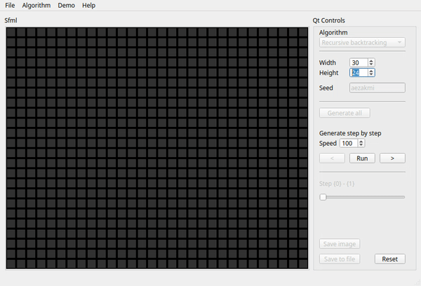

Generator labiryntów
===============================================================================

Generowanie labiryntów o zadanych rozmiarach za pomocą różnych algorytmów

Przykład działania
*******************************************************************************

Aktualnie dostępne są dwa generatory:
 * Randomized depth-first search
 * Randomized Kruskal's algorithm

Plany na przyszłość
*******************************************************************************
Oprócz dodania nowych generatorów chciałbym także dodać możliwość generowania
labiryntów heksagonalnych lub złożonych z trójkątów. Chcę sprawdzić jak dobrze
mój kod sprawdzi się przy takiej próbie rozszerzenia funkcjonalności
