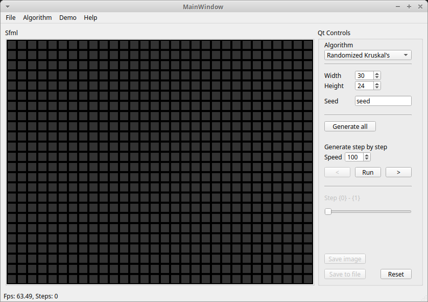

QtSfmlDemo
===============================================================================

Aplikacja demostracyjna pokazująca działanie różnych algorytmów

Motywacja: Posiadanie jednej aplikacji wspólnej dla wszyskich projektów
związanych z algorytmami. Łatwiej zachować spójność kodu i rozwiązań w jednej
dużej aplikacji niż w wielu mniejszych. Łatwiej też tym zarządzać. Poza tym
chciałem sprawdzić jak idzie mi projektowanie programu, który będzie z czasem
rozszerzany o nowe moduły.

Okno programu
*******************************************************************************

Okno programu jest podzielone na dwie części: okno sfml i panel z przyciskami.
Panel z przyciskami zmienia się w zależności od wybranego algorytmu. Nie ma tu
wielkiej filozofii.

Na uwagę załugują jedynie dwie pozycje w menu programu "Agorithm" i "Demo".
Ta pierwsza to implementacje róznych algorymów znalezionych w internecie. 
Druga opcja to proste programiki w SFML, które mogą korzystać z tych algorytmów
albo proste gry np. snake

Plany na przyszłość
*******************************************************************************
Więcej algorytmów
